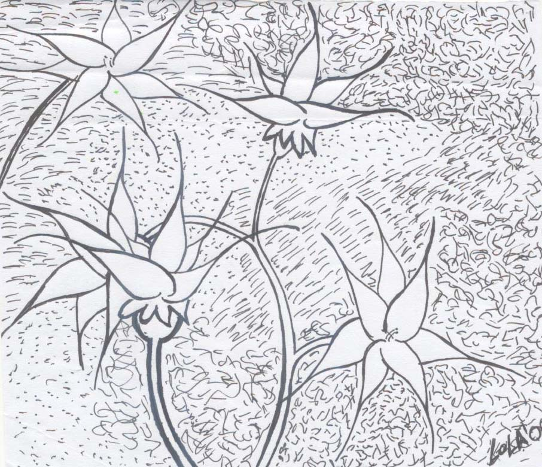

# M.Dolores Pérez-Hernández (Lola)
 
# Education
## - [Marine Faculty, Universidad de Las Palmas de Gran Canaria (ULPGC), Spain](http://www.fcm.ulpgc.es): Bachelor, Master and Ph.D
## - [Woods Hole Oceanographic Institution,USA](www.whoi.edu): Postdoc
## - [Marine and Freshwater Research Institute, Iceland](www.hafogvatn.is): Researcher
## - [Instituto de Oceanografía y Cambio Global (IOCAG-ULPGC)](http://iocag.ulpgc.es): Tenure track researcher
